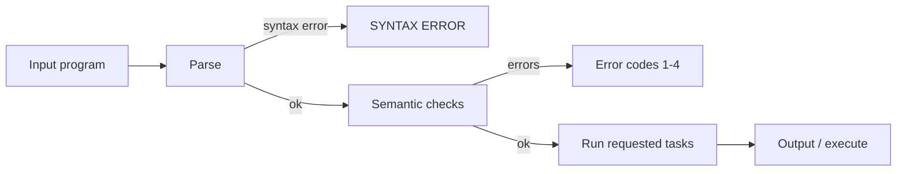
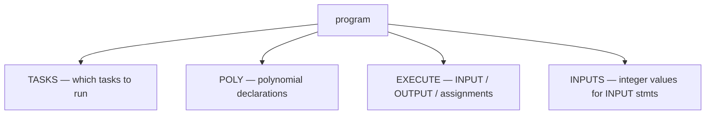

# CSE 340 Project 1 — Simple Compiler

A recursive-descent parser for a small language. Checks syntax and semantics, then runs analysis tasks or executes the program.

## Quick start

```bash
make
make test
```

## What it does



### Input has four sections



| Section | Purpose |
|---------|---------|
| **TASKS** | Task numbers (2 = run program, 3–5 = warnings/analysis) |
| **POLY** | Named polynomials, e.g. `F(x) = x^2 + 1;` |
| **EXECUTE** | `INPUT`, `OUTPUT`, and `name = Poly(args);` statements |
| **INPUTS** | Values consumed by `INPUT` statements in order |

### Processing order

1. Parse everything — stop on syntax error.
2. Check semantic errors (undeclared poly, bad args, etc.) — print error codes and stop.
3. If clean, run only the tasks listed in TASKS (warnings, execution, degree analysis).

## Tasks

| Task | What it does |
|------|--------------|
| **Parsing** | Build parse tree; report `SYNTAX ERROR` |
| **Semantic 1–4** | Undeclared poly, wrong arg count, invalid param, duplicate poly |
| **2** | Execute program — evaluate polynomials, `INPUT`/`OUTPUT` |
| **3** | Warn: variable used before initialized |
| **4** | Warn: useless assignment |
| **5** | Print polynomial degrees |

## Source files

| File | Role |
|------|------|
| `provided_code/parser.cc` | **Your code** — parser + semantics + execution |
| `provided_code/parser.h` | **Your code** — data structures and class interface |
| `provided_code/lexer.cc`, `inputbuf.cc` | Provided — do not modify |

## Gradescope

Submit **`parser.cc`** and **`parser.h`** (individual files, no zip).

| Submit | Do not submit |
|--------|---------------|
| `provided_code/parser.cc` | `lexer.cc`, `lexer.h`, `inputbuf.cc`, `inputbuf.h` |
| `provided_code/parser.h` | Makefile, tests, `a.out` |

**Grading:** Parsing 30% (all-or-nothing), semantic errors 7.5% each, Task 2 output 20%, Tasks 3–5 10% each.

See `docs/CSE340S25B_Project1.pdf` for full spec.

## Test

```bash
make test    # runs provided_code/test1.sh on provided_tests/
```

## Other commands

```bash
make clean
make format  # clang-format on parser.cc and parser.h
make debug   # build with -g -O0
```

## Debug (Cursor)

1. Install **CodeLLDB** (`vadimcn.vscode-lldb`) if prompted.
2. Set breakpoints in `parser.cc`.
3. **Run and Debug** (`Cmd+Shift+D`):
   - **Debug project-1** — `Task_2/t1.txt`
   - **Debug project-1 (pick test file)** — choose input first
4. Press **F5** to build and start.

Use `cerr` for debug prints so they don't affect `make test` output.

If breakpoints don't hit, run `make debug` first or press F5 again to rebuild with `-g`.
