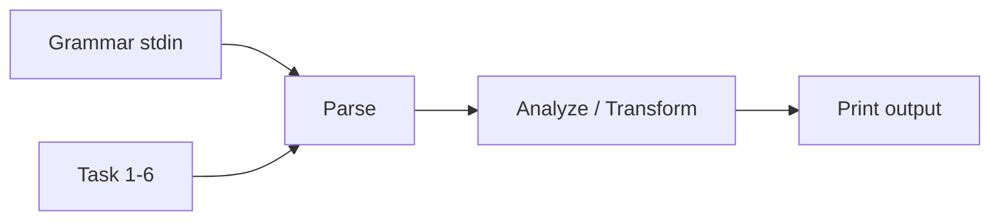
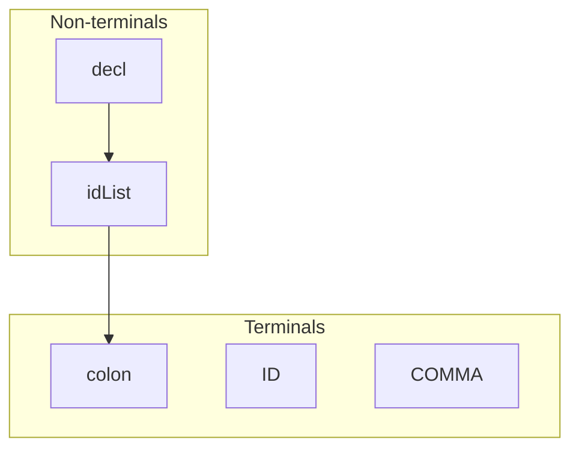
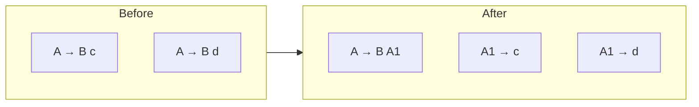
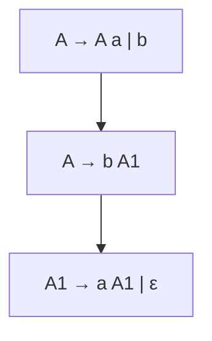
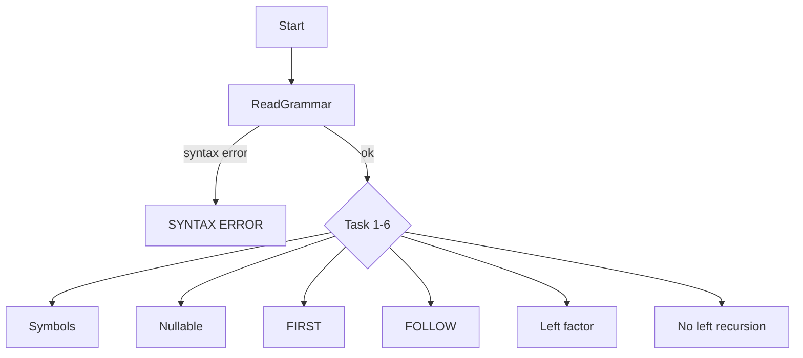

# CSE 340 Project 2 — Grammar Analyzer

Reads a **context-free grammar** from stdin, runs **one of six tasks** from a command-line argument, and prints the result.

## Quick start

```bash
make
make test-all          # all tasks 1–6
make test TASK=3       # one task
./a.out 3 < tests/test01.txt
```

## What it does



### Input format

```
decl -> idList colon ID *
idList -> ID idList1 *
idList1 -> COMMA ID idList1 | *
#
```

| Token | Meaning |
|-------|---------|
| `LHS -> rhs *` | One rule |
| `\|` | OR — split into separate rules |
| empty rhs | ε (nullable) |
| `#` | End of grammar |

**Non-terminal** = name on the **left** of `->`.  
**Terminal** = name that never appears on the left.  
**Start symbol** = LHS of the **first** rule.



## The six tasks

| Task | What it prints |
|------|----------------|
| **1** | Terminals, then non-terminals (first-appearance order) |
| **2** | Nullable non-terminals — can derive ε |
| **3** | FIRST sets — what can start each non-terminal |
| **4** | FOLLOW sets — what can follow each non-terminal (`$` = end) |
| **5** | **Left-factored** grammar (shared prefixes pulled out) |
| **6** | Grammar with **left recursion removed** |

### Task 5 — left factoring



### Task 6 — remove left recursion



Tasks 5–6 print rules as `LHS -> rhs #` (lexicographically sorted).

## Program flow



## Source files

| File | Role |
|------|------|
| `src/project2.cc` | **Your code** |
| `src/lexer.cc`, `src/inputbuf.cc` | Provided — do not modify |

## Gradescope

Submit **`project2.cc` only** (individual file, no zip).

| Submit | Do not submit |
|--------|---------------|
| `src/project2.cc` | `lexer.cc`, `lexer.h`, `inputbuf.cc`, `inputbuf.h`, Makefile, tests |

**Grading (100 pts):** parsing (−15% if wrong), Task 1 (10), Task 2 (10), Task 3 (20), Task 4 (20), Task 5 (20), Task 6 (20).

Use the **iterative** class algorithms for Nullable/FIRST/FOLLOW — deep recursion can time out.

See `docs/CSE340S25_Proj2.pdf` for full output format.

## Other commands

```bash
make debug    # build with -g
make format   # clang-format on project2.cc
make clean
```
